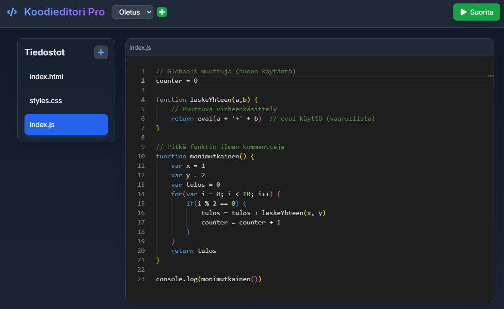

# Code Editor Pro

A modern browser-based code editor that supports multiple programming languages and provides real-time code analysis. Built with React + Node.js technologies.

**Note: This is a demonstration project intended for testing and learning purposes only. The code is not saved permanently - it uses browser's local storage for temporary storage. The main purpose of this project was to practice full-stack development by combining frontend and backend technologies.**

## Features

### Editor
- Support for multiple programming languages (JavaScript, Python, HTML, CSS)
- VS Code-style editor (Monaco Editor)
- Real-time HTML/CSS preview
- Automatic saving to browser's local storage (temporary)

### Code Analysis
- Automatic code quality analysis
- Best practices detection
- Warning notifications for potential issues
- Improvement suggestions

### Project Management
- Multi-project support (stored in browser's local storage)
- File addition and removal
- Ready-made project templates (Web and Python)

## Technologies

### Frontend
- React
- Monaco Editor
- TailwindCSS
- Axios

### Backend
- Node.js
- Express
- Python-shell

## Requirements

- Node.js (v14 or newer)
- Python (v3.6 or newer)
- Modern browser (Chrome, Firefox, Safari, Edge)

## Installation

1. Clone repository
git clone https://github.com/RampeK/code-editor-pro.git
cd code-editor-pro

2. Install dependencies
npm install

3. Start server
cd server
npm run dev

4. Open new terminal and start frontend in project root
npm run dev

Application launches automatically in browser. By default:
- Frontend: http://localhost:5173 (or next available port)
- Backend: http://localhost:3001 (or PORT from environment variables)

## User Guide

### Basic Usage
- Create new file with "+" button
- Select programming language
- Write code in editor
- Run code with "Run" button
- Check results in console
- Analyze code with "Analyze Code" button

### HTML/CSS Preview
- When editing HTML or CSS files, preview appears automatically in "Preview" panel
- Preview updates in real-time as you edit code
- You can test different screen sizes in preview

### File Storage
- All files are automatically saved to browser cache
- You can clear storage with "Clear Storage" button
- Note: Clearing browser cache removes all saved files

### Code Analysis
Analysis shows:
- Potential errors and warnings
- Improvement suggestions
- Best practice tips

### Project Management
- Select project from "Default" menu
- Create new project with "+" button
- All projects are saved to browser cache
- You can delete project by clearing storage

### Console
- Shows code execution results
- JavaScript console.log() outputs
- Possible error messages
